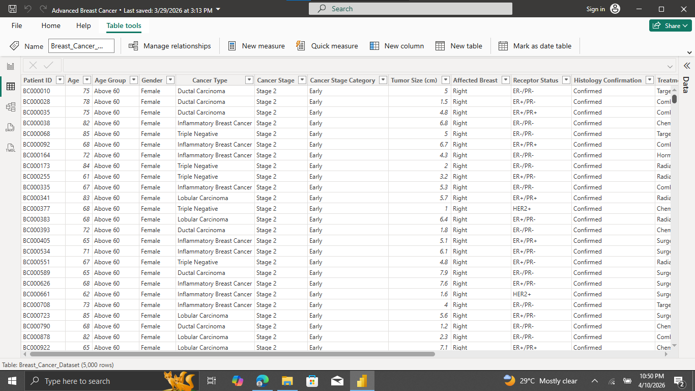
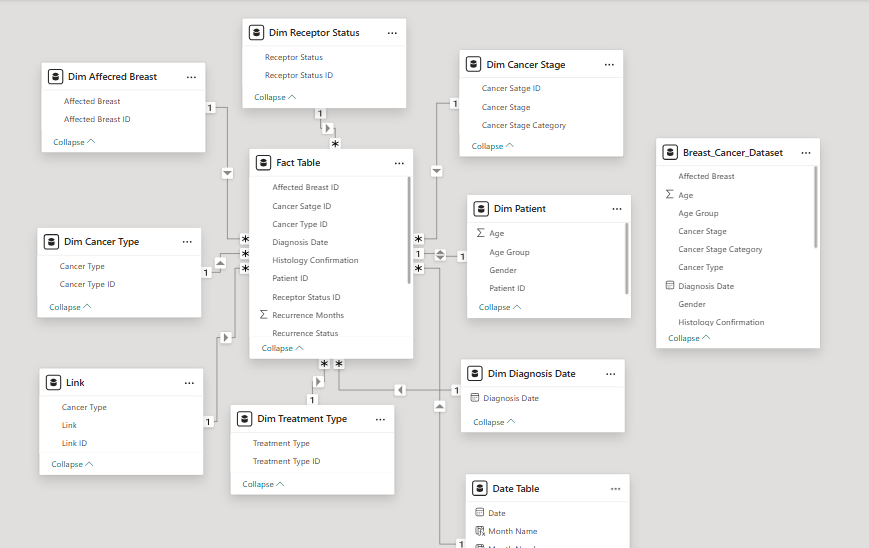
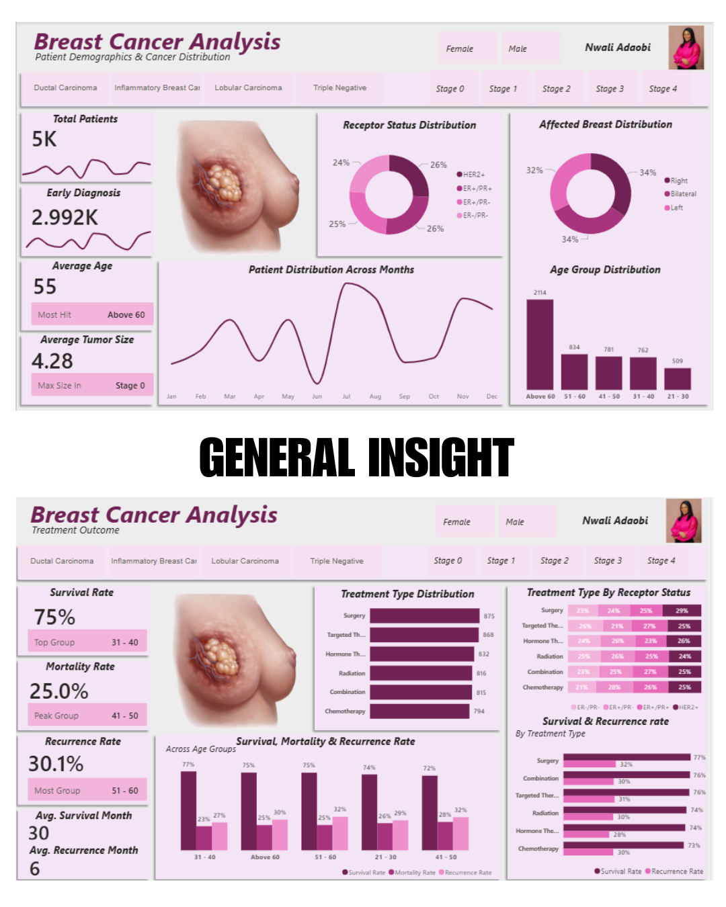
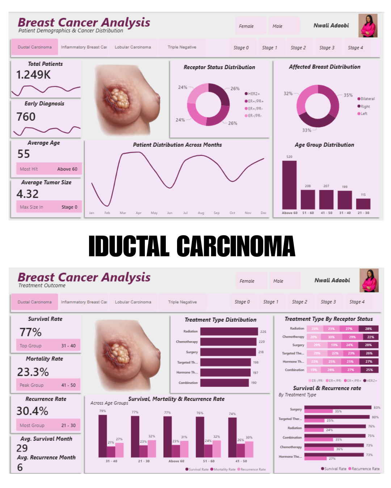
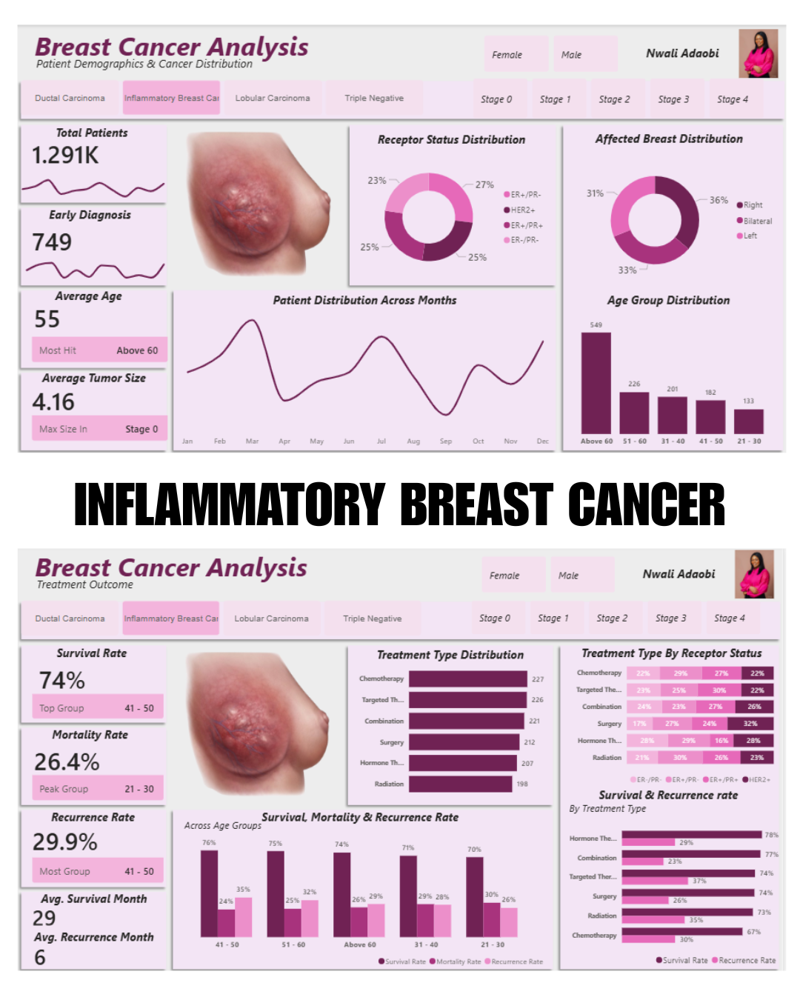
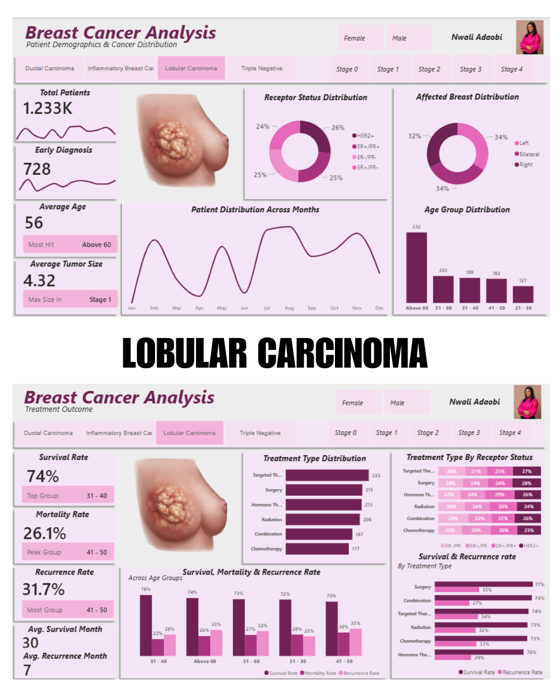
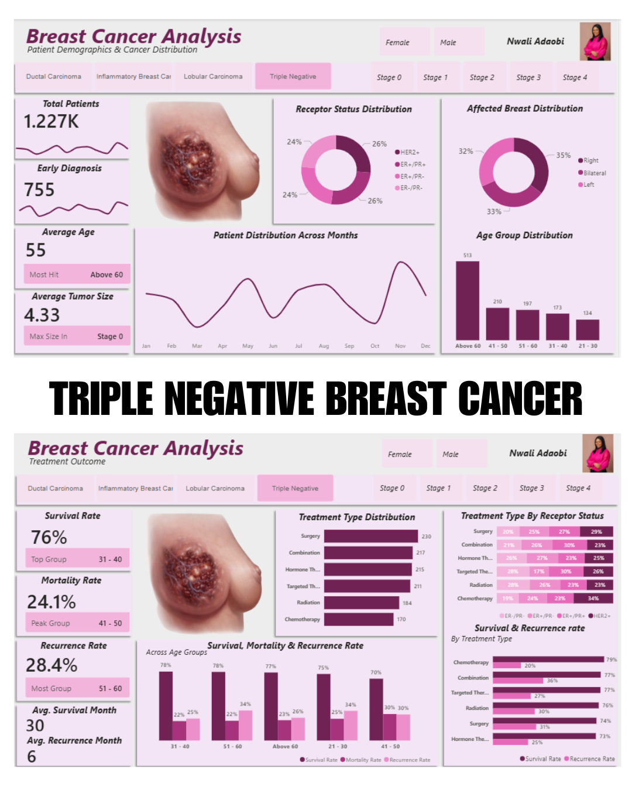

# BREAST-CANCER-PATIENT-ANALYSIS

## Introduction
Breast Cancer is a disease in which abnormal cells in the breast grow uncomfortably, forming a tumor that can invade surrounding tissues or spread to other parts of the body. It is one of the most common cancers affecting women worldwide, although it can also occur in men. The project focuses on analyzing a one-year patient records, including survival and recurrence outcomes, to create interactive dashboards to present outcomes and enhance treatment effectiveness.

## Problem Statement
Breast Cancer remains a significant public health concern, with varying patient outcomes influenced by factors such as age, cancer type, stage at diagnosis, tumor characteristics, and treatment methods. In this analysis project, the challenge is to systemically explore and interpret the data to identify key patterns, trends, and outcomes, by building interactive dashboards to present insights, answering key questions that can support Clinician decision making and improve patient outcomes.

## Data Sourcing
The dataset is a fictional breast cancer patient record.

**Time Period**: January 2025 to December 2025

**Records**: 5000 Patient records

**Key Fields**: 
  - Patient 1D
  - Age
  - Gender
  - Cancer Type
  - Cancer Stage
  - Tumor Size
  - Affected Breast
  - Receptor Status
  - Treatment Type
  - Diagnosis Date
  - Survival Status
  - Recurrence Status

## Data Transformation and Cleaning
Before analysis, the raw data was prepared in Power Query for accuracy and consistency.
  - Created a backup copy of the original dataset
  - Created Calculated Columns such as Age Group and Cancer Type Category for more insights

**_View the cleaned data below_**

## Data Modelling
A Star schema model was built in Power BI to support efficient analysis and performance.

**Fact Table**
  - Fact Visit (Patient ID, Diagnosis Date, Tumor Size, Survival Status, Survival Months, Recurrence Status and Recurrence Months)
    
**Dimension Tables**
  - Dim Patient
  - Dim Affected Breast
  - Dim Cancer Stage
  - Dim Cancer Type
  - Dim Diagnosis Date
  - Dim Treatment Type
  - Dim Receptor Status
    
**Relationship**
  - One to many relationships from each dimension table to fact visit table.
  - Data table marked as the official data table.
    
This model structure allows flexible slicing and filtering across all visuals.

**_View Data Modl here_**

## Analytics and Measures
Key DAX measures were created to monitor trends

**Early Diagnosis**
  - Early Diagnosis = CALCULATE(COUNT('Fact Table'[Patient ID]),'Dim Cancer Stage'[Cancer Stage Category] = "Early")

**Survival Rate**
  - Survival Rate = DIVIDE(CALCULATE(COUNT('Fact Table'[Patient ID]),'Fact Table'[Survival Status] = "Survived"),COUNT('Fact Table'[Patient ID]))

**Mortality Rate**
  - Mortality Rate = DIVIDE(CALCULATE(COUNT('Fact Table'[Patient ID]),'Fact Table'[Survival Status] = "Deceased"),COUNT('Fact Table'[Patient ID]))

**Recurrence Rate**
  - Recurrence Rate = DIVIDE(CALCULATE(COUNT('Fact Table'[Patient ID]),'Fact Table'[Recurrence Status] ="Yes"),COUNT('Fact Table'[Patient ID]))

## Dashboard and Visuals
Dashboard screenshots are placed here in the portfolio
The dashboard includes:
**KPI Cards**:
  - Total Patients
  - Early Diagnosis 
  - Average Age
  - Average Tumor Size
  - Survival Rate
  - Mortality Rat
  - Recurrence Rate
    
**Line Chart**:
  - Patient Distributions Across Months
    
**Bar Chart**: 
  - Treatment Type Distribution
  - Treatment Type by Receptor Status
  - Survival & Recurrence rate by Treatment Type
    
**Column Chart**:
  - Age Group Distribution
  - Survival, Mortality & Recurrence Rate across Age Group
    
**Pie Chart**:
  - Receptor Status Distribution
  - Affected Breast Distribution
    
**Slicers**: 
  - Gender
  - Cancer Type
  - Stages
    
This layout is designed for clear review and interactive explanation.

**_View General Insight Dashboard here_**

## Insights and Findings
The dataset comprises 5,000 breast cancer patients, providing a robust foundation for identifying trends in diagnosis, treatment, and outcomes. 

**General Analysis**
The gender distribution is predominantly female, with 4,770 female patients and 280 male patients, reflecting the higher prevalence of breast cancer among women while acknowledging its occurrence in men, with average tumor size is approximately 4.28 cm.

A total of 2,992 cases were diagnosed at an early stage (stage 0, 1 and 2). indicating a relatively strong rate of early detection within the dataset, which is critical for improving patient survival outcomes.

The average patient age is 55 years, suggesting that breast cancer is more common among middle-aged and older individuals, consistent with established clinical patterns.

The analysis reveals that individuals above 60 years represent the most affected age group, while those between 21 and 30 years are the least affected. Survival outcomes are highest among patients aged 31–40, whereas mortality is more prominent in the 41–50 age group, and recurrence is highest among patients aged 51–60.

Breast cancer diagnoses peak in the month of July, with approximately 450 recorded cases, indicating a notable temporal trend in detection rates.

The overall survival rate is 75%, while the mortality rate stands at 25%, reflecting moderate treatment success across the dataset. The average survival duration is 80 months, and the average recurrence period is 6 months, highlighting the need for continuous monitoring after treatment.
Recurrence occurs in approximately 30.1% of patients, with treatment type playing a significant role in influencing recurrence outcomes.

**Stage Based Analysis**
Stage-based analysis shows a clear decline in survival rates as cancer progresses. Survival is highest at Stage 0 (96%) and Stage 1 (95%), but drops significantly in advanced stages, with Stage 3 at 56% and Stage 4 at 54%, emphasizing the importance of early detection.

Treatment effectiveness varies across stages, with combination therapy showing the highest success in early and advanced stages, while surgery and hormone therapy are particularly effective in Stage 1. Targeted therapy demonstrates strong performance in Stage 2 and Stage 4 cases.

**Breast Cancer Type Analysis**
For Ductal Carcinoma, a total of 1,249 patients were recorded, with 760 early diagnoses and an average tumour size of 4.32 cm. The survival rate is 77%, with a mortality rate of 23.3% and a recurrence rate of approximately 30.4%. Targeted therapy shows a strong balance between improving survival and reducing recurrence.

In the case of Inflammatory Breast Cancer, 1,241 patients were analyzed, including 749 early diagnoses, with an average tumour size of 4.16 cm. The survival rate is 74%, mortality rate 26.4%, and recurrence rate 29.9%. Combination therapy demonstrates a balanced effectiveness in managing both survival and recurrence.

For Lobular Carcinoma, the dataset includes 1,283 patients, with 728 diagnosed early and an average tumour size of 4.32 cm. The survival rate is 74%, mortality rate 26.1%, and recurrence rate 31.7%. Combination therapy is observed to provide a favorable balance between survival outcomes and recurrence control.

In Triple Negative Breast Cancer (TNBC), 1,227 patients were recorded, with 755 early diagnoses and an average tumour size of 4.38 cm. The survival rate is 76%, mortality rate 24.1%, and recurrence rate 28.4%. Chemotherapy demonstrates effectiveness in balancing survival and recurrence outcomes in this group.

## Recommendations
  - Early detection strategies should be strengthened through increased awareness campaigns, routine screenings, and access to diagnostic services, as this significantly improves survival outcomes.
  
  - Healthcare providers should adopt multimodal treatment approaches (combining surgery, chemotherapy, radiotherapy, and targeted therapy) where appropriate, as they offer a better balance between survival and recurrence control.
  
  - Treatment plans should be personalized based on cancer stage, type, and patient characteristics, ensuring that patients receive the most effective therapy for their condition.
    
  - Special attention should be given to high-risk age groups, particularly patients above 60 and those between 41–60, through closer monitoring and tailored interventions.
  
  - Healthcare systems should improve post-treatment follow-up and monitoring, especially within the first few months, to detect and manage recurrence early.
  
  - Finally, continuous data collection and analysis should be encouraged to support evidence-based decision-making and improve future breast cancer management strategies.

##Conclusion
This analysis underscores the importance of early detection in improving breast cancer survival outcomes, as survival rates decline significantly with advancing stages. 
Treatment effectiveness varies across cancer types and stages, with multimodal (combined) treatment approaches demonstrating the most consistent balance between survival improvement and recurrence control. Patient age also influences clinical outcomes, particularly in survival, mortality, and recurrence patterns. These findings highlight the need for personalized and stage-specific treatment strategies. Overall, integrating multimodal therapy into treatment plans can significantly enhance patient outcomeThe average tumor size is approximately 4.28 cm, providing insight into disease progression at diagnosis and its potential impact on treatment strategies.

## Author
Nwali Adaobi (Data Analyst)
